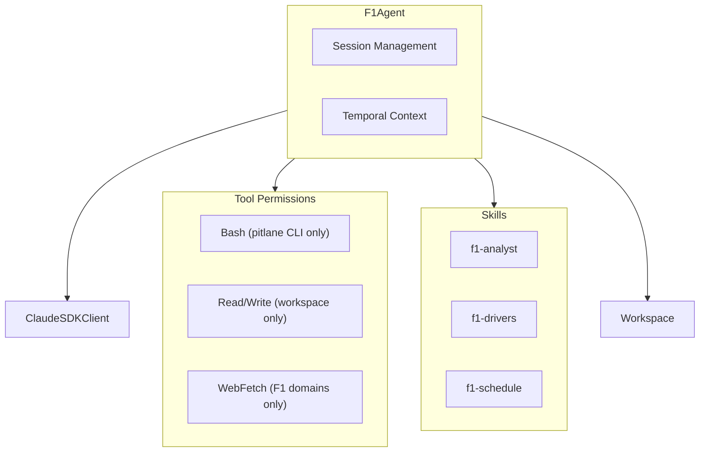

# Agent System

PitLane-AI's agent system is built on the [Claude Agent SDK](https://github.com/anthropics/anthropic-sdk-python), providing an agentic framework for F1 data analysis with tool access, permission controls, and session management.

## Architecture Overview

The core agent architecture consists of three main components:



## F1Agent Class

The [`F1Agent`](https://github.com/jshudzina/PitLane-AI/blob/main/packages/pitlane-agent/src/pitlane_agent/agent.py) class is the primary interface for interacting with the AI agent.

### Initialization

```python
from pitlane_agent import F1Agent

# Auto-generated session
agent = F1Agent()

# Explicit session ID
agent = F1Agent(session_id="my-session-123")

# With tracing enabled
agent = F1Agent(enable_tracing=True)

# Without temporal context
agent = F1Agent(inject_temporal_context=False)
```

**Parameters:**

- `session_id` (optional): Session identifier. Auto-generated UUID if not provided.
- `workspace_dir` (optional): Explicit workspace path. Derived from `session_id` if None.
- `enable_tracing` (optional): Enable OpenTelemetry tracing. Uses `PITLANE_TRACING_ENABLED` env var if None.
- `inject_temporal_context` (optional): Inject F1 calendar context into system prompt. Default: `True`.

### Chat Methods

The agent provides two methods for interaction:

#### Streaming Response

```python
async for chunk in agent.chat("Who won the Monaco Grand Prix?"):
    print(chunk, end="", flush=True)
```

Yields text chunks as they're generated, enabling real-time display.

#### Full Response

```python
response = await agent.chat_full("Analyze lap times for Hamilton in Bahrain 2024")
print(response)
```

Returns the complete response as a single string.

## Agent Configuration

### System Prompt

The agent uses the `claude_code` preset system prompt with optional temporal context appended:

```python
options = ClaudeAgentOptions(
    cwd=str(PACKAGE_DIR),
    setting_sources=["project"],
    allowed_tools=["Skill", "Bash", "Read", "Write", "WebFetch"],
    can_use_tool=can_use_tool_with_context,
    system_prompt={
        "type": "preset",
        "preset": "claude_code",
        "append": temporal_prompt,  # F1 calendar awareness
    }
)
```

### Allowed Tools

The agent has access to five tools:

| Tool | Purpose | Restrictions |
|------|---------|--------------|
| **Skill** | Invoke F1 analysis skills | None - delegated to skill permissions |
| **Bash** | Execute shell commands | Restricted to `pitlane` CLI only |
| **Read** | Read files | Restricted to workspace directory |
| **Write** | Write files | Restricted to workspace directory |
| **WebFetch** | Fetch web content | Restricted to F1-related domains |

See [Tool Permissions](tool-permissions.md) for detailed restrictions.

### Skills Integration

Skills are discovered and loaded from the `.claude/skills/` directory:

```
packages/pitlane-agent/src/pitlane_agent/.claude/skills/
├── f1-analyst/
│   ├── skill.md           # Skill definition
│   ├── lap_times.py       # Lap time analysis
│   └── tyre_strategy.py   # Tyre strategy visualization
├── f1-drivers/
│   └── drivers.py         # Driver information via Ergast API
└── f1-schedule/
    └── schedule.py        # Event calendar queries
```

Each skill provides specialized functionality with its own prompt, scripts, and dependencies.

## Session Management

### Workspace Isolation

Each agent session has an isolated workspace:

```
~/.pitlane/workspaces/<session-id>/
├── .metadata.json         # Session metadata
├── data/                  # Session-specific data
└── charts/                # Generated visualizations
```

The session ID is passed to skills via the `PITLANE_SESSION_ID` environment variable, enabling workspace-scoped operations.

### Session Lifecycle

1. **Creation**: Workspace created on first agent initialization
2. **Access**: `last_accessed` timestamp updated on each agent init
3. **Cleanup**: Old workspaces cleaned via `pitlane workspace clean`

## Tracing and Observability

The agent supports OpenTelemetry tracing through hooks:

```python
hooks = {
    "PreToolUse": [HookMatcher(matcher=None, hooks=[pre_tool_use_hook])],
    "PostToolUse": [HookMatcher(matcher=None, hooks=[post_tool_use_hook])],
}
```

Enable tracing to observe:

- Tool invocations and results
- Permission checks and denials
- Skill executions
- Decision flows

See [Agent CLI: Tracing](../agent-cli/tracing.md) for configuration.

## Related Documentation

- [Temporal Context](temporal-context.md) - F1 calendar awareness
- [Skills](skills.md) - Skill system architecture
- [Tool Permissions](tool-permissions.md) - Tool restriction system
- [Workspace Management](workspace-management.md) - Session isolation
