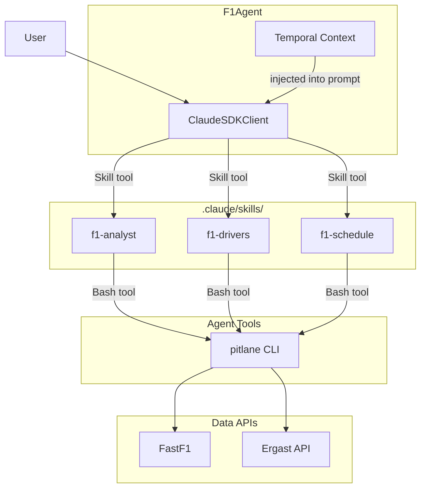
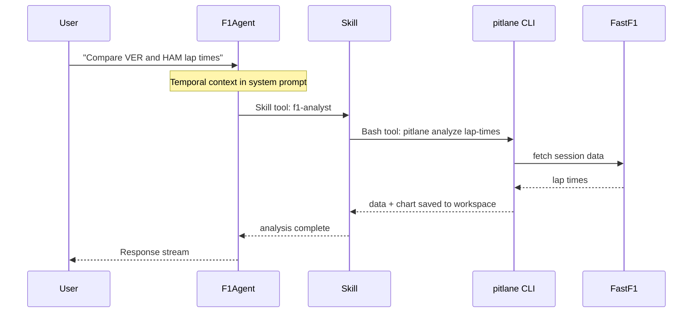

# Architecture Overview

!!! info "Claude Agent SDK Demonstration"
    PitLane-AI demonstrates practical patterns for building AI agents:

    - **Skills** - Composable, domain-specific agent capabilities
    - **Progressive Disclosure** - Just-in-time context via temporal awareness
    - **Tool Permissions** - Layered restrictions for safe agent behavior

## System Architecture



## Core Components

### 1. F1Agent

The main agent class that orchestrates all functionality:

- **Session Management**: Unique session IDs with workspace isolation
- **Temporal Context**: Real-time F1 calendar awareness
- **Tool Permissions**: Restricted tool access for security
- **Tracing**: OpenTelemetry observability hooks

[Learn more →](agent-system.md)

### 2. Skills System

Modular, composable skills for domain-specific analysis:

- **f1-analyst**: Lap times, strategy, telemetry analysis
- **f1-drivers**: Driver information via Ergast API
- **f1-schedule**: Event calendar and session schedules

Each skill has its own prompt, tool restrictions, and data access patterns.

[Learn more →](skills.md)

### 3. Temporal Context

Real-time awareness of the F1 calendar at multiple granularities:

- **Season Level**: Current year, phase (pre/in/post/off-season)
- **Race Weekend Level**: Current/last/next race events
- **Session Level**: Live/recent/upcoming sessions

Injected into the agent's system prompt for contextual understanding.

[Learn more →](temporal-context.md)

### 4. Tool Permissions

Defense-in-depth security through tool restrictions:

- **Bash**: Restricted to `pitlane` CLI only
- **Read/Write**: Restricted to workspace directory
- **WebFetch**: Restricted to F1-related domains
- **Skill**: No restrictions (delegated to skill permissions)

[Learn more →](tool-permissions.md)

### 5. Workspace Management

Session-based workspaces for data isolation:

```
~/.pitlane/workspaces/<session-id>/
├── .metadata.json
├── data/              # Session data
└── charts/            # Generated visualizations
```

Enables concurrent sessions and multi-user deployments.

[Learn more →](workspace-management.md)

## Query Flow



## Design Principles

The architecture emphasizes **modularity** (skills as composable units), **security** (layered tool restrictions), and **context awareness** (temporal state injection). Each skill operates in a sandbox with only the tools it needs.

## Package Structure

PitLane-AI is organized as a monorepo with two main packages:

```
packages/
├── pitlane-agent/          # Core agent library
│   ├── src/pitlane_agent/
│   │   ├── agent.py        # F1Agent class
│   │   ├── temporal/       # Temporal context system
│   │   ├── tool_permissions.py
│   │   ├── tracing.py      # OpenTelemetry hooks
│   │   ├── commands/       # CLI commands
│   │   └── .claude/skills/ # F1 analysis skills
│   └── tests/
│
└── pitlane-web/            # Web interface
    ├── src/pitlane_web/
    │   ├── app.py          # FastAPI application
    │   ├── agent_manager.py # Multi-session management
    │   └── templates/      # Jinja2 templates
    └── tests/
```

## Technology Stack

| Layer | Technology |
|-------|-----------|
| **Agent Framework** | Claude Agent SDK |
| **LLM** | Claude Sonnet 4.5 |
| **F1 Data Layer** | [FastF1](https://docs.fastf1.dev/) (telemetry, timing, sessions)<br>[jolpica-f1/Ergast API](https://github.com/jolpica/jolpica-f1) (driver info, historical data) |
| **Visualization** | Matplotlib |
| **Web Framework** | FastAPI |
| **Streaming** | Server-Sent Events |
| **Tracing** | OpenTelemetry |
| **Package Manager** | uv (monorepo workspace) |
| **Testing** | pytest, pytest-asyncio |

## Next Steps

Explore specific architectural components:

- [Agent System](agent-system.md) - Core F1Agent implementation
- [Temporal Context](temporal-context.md) - F1 calendar awareness
- [Skills](skills.md) - Skill system and available skills
- [Tool Permissions](tool-permissions.md) - Security model
- [Workspace Management](workspace-management.md) - Session isolation

Or jump to usage documentation:

- [User Guide: Web Interface](../user-guide/web-interface.md) - Using PitLane-AI
- [Agent CLI](../agent-cli/cli-reference.md) - CLI reference (for agents/developers)
- [Developer Guide](../developer-guide/setup.md) - Contributing and extending
