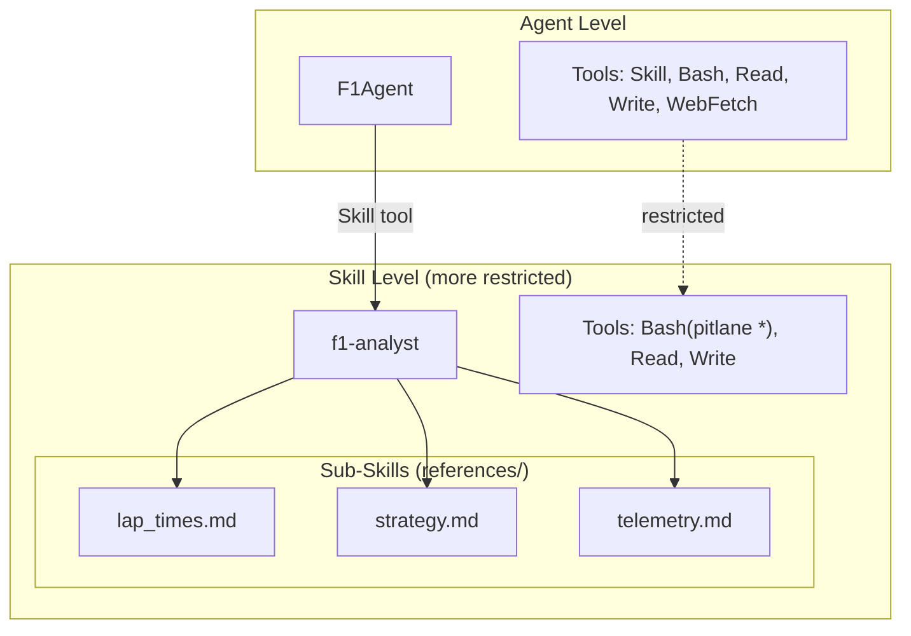

# Skills

Skills are composable, domain-specific modules that extend the agent's capabilities. Each skill has its own prompt and **restricted tool access** - demonstrating layered security.



## Skill Structure

Skills live in the `.claude/skills/` directory:

```
packages/pitlane-agent/src/pitlane_agent/.claude/skills/
├── f1-analyst/
│   ├── SKILL.md           # Skill definition and prompt
│   └── references/        # Sub-skill documentation
│       ├── lap_times.md   # Lap time analysis guide
│       ├── strategy.md    # Strategy analysis guide
│       └── telemetry.md   # Telemetry analysis guide
├── f1-drivers/
│   └── SKILL.md           # Driver information skill
└── f1-schedule/
    └── SKILL.md           # Schedule queries skill
```

## Skill Definition Format

Skills are defined using frontmatter in `SKILL.md`:

```markdown
---
name: f1-analyst
description: Answer questions about F1 races, drivers, qualifying, and practice sessions.
allowed-tools: Bash(pitlane *), Read, Write
---

# F1 Data Analyst

You are an F1 data analyst with access to historical race data via FastF1...

[Skill prompt continues...]
```

**Frontmatter Fields:**

- `name`: Skill identifier (used for invocation)
- `description`: When to use this skill (shown to main agent)
- `allowed-tools`: Tools available within the skill context

## Available Skills

### f1-analyst

**Purpose**: Data analysis and visualization using FastF1

**When to Use**: Questions about lap times, race results, strategy, telemetry

**Capabilities**:
- Lap time analysis and distributions
- Tyre strategy visualization
- Telemetry comparison (speed, throttle, brake)
- Session data queries

**Tool Access**:
- `Bash`: Restricted to `pitlane` CLI commands only
- `Read`: Restricted to workspace directory
- `Write`: Restricted to workspace directory

**Example Invocation**:
```
User: "Compare Verstappen and Hamilton lap times in Monaco 2024"
Agent: [Invokes f1-analyst skill]
Skill: [Executes pitlane CLI commands, generates visualization]
```

### f1-drivers

**Purpose**: Driver information queries via Ergast API

**When to Use**: Questions about driver details, codes, nationalities

**Capabilities**:
- Driver roster by season
- Driver codes and Wikipedia links
- Nationality and career data

**Tool Access**:
- `Bash`: Restricted to `pitlane` CLI commands
- `Read`: Restricted to workspace directory

**Example Invocation**:
```
User: "Who drove for Ferrari in 2019?"
Agent: [Invokes f1-drivers skill]
Skill: [Queries Ergast API, returns driver list]
```

### f1-schedule

**Purpose**: Event calendar and session timing queries

**When to Use**: Questions about race dates, locations, session schedules

**Capabilities**:
- Season calendar with dates and locations
- Session timing (FP1, FP2, FP3, Q, R)
- Round numbers and event names

**Tool Access**:
- `Bash`: Restricted to `pitlane` CLI commands
- `Read`: Restricted to workspace directory

**Example Invocation**:
```
User: "When is the next race?"
Agent: [Invokes f1-schedule skill]
Skill: [Queries schedule, returns next event details]
```

## Skill Invocation

Skills are invoked using the `Skill` tool:

```python
# Agent SDK handles skill discovery and execution
client.invoke_tool("Skill", {"skill": "f1-analyst"})
```

The agent automatically:
1. Loads the skill prompt from `SKILL.md`
2. Applies tool restrictions from `allowed-tools`
3. Passes the user query to the skill context
4. Returns skill results to main conversation

## Workspace Integration

Skills access session data via the `PITLANE_SESSION_ID` environment variable. All data and charts are stored in `~/.pitlane/workspaces/<session-id>/`.

## Tool Permissions in Skills

Skills have **more restricted tool access** than the main agent:

| Tool | Main Agent | Skills |
|------|-----------|--------|
| Skill | ✓ Allowed | ✗ Not allowed (no nested skills) |
| Bash | Restricted to `pitlane` CLI | Restricted to `pitlane` CLI |
| Read | Workspace only | Workspace only |
| Write | Workspace only | Workspace only |
| WebFetch | F1 domains only | ✗ Not allowed (unless specified) |

This ensures skills operate within safe boundaries and can't escalate permissions.

## Sub-Skills Pattern

Complex skills like `f1-analyst` use **sub-skills** for organization:

```
f1-analyst/
├── SKILL.md                  # Main skill prompt
└── references/
    ├── lap_times.md          # Lap time analysis sub-skill
    ├── strategy.md           # Strategy analysis sub-skill
    ├── telemetry.md          # Telemetry analysis sub-skill
    └── standings.md          # Standings analysis sub-skill
```

The main skill prompt routes to sub-skills based on query type:

```markdown
## Analysis Types

Based on the user's question, read the appropriate reference file:

### Lap Time Analysis
**When to use:** Questions about lap times, pace comparison...
**Read:** [references/lap_times.md](references/lap_times.md)

### Strategy Analysis
**When to use:** Questions about tyre strategy, pit stops...
**Read:** [references/strategy.md](references/strategy.md)
```

This enables:
- Modular skill development
- Focused prompts per analysis type
- Easier testing and maintenance

## Security Model

Skills are sandboxed: Bash is limited to `pitlane` CLI commands, file access is restricted to the workspace directory, and skills cannot invoke other skills (no escalation).

## Adding New Skills

See [Developer Guide: Adding Skills](../developer-guide/adding-skills.md) for creating custom skills.

## Related Documentation

- [Agent System](agent-system.md) - How skills integrate with F1Agent
- [Tool Permissions](tool-permissions.md) - Tool restriction details
- [Workspace Management](workspace-management.md) - Session isolation
- [Agent CLI: Using Skills](../agent-cli/skills-usage.md) - How agent skills work
