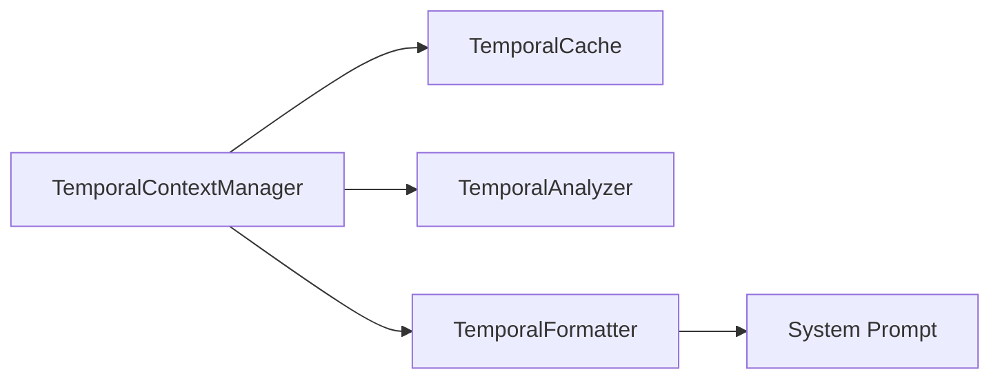
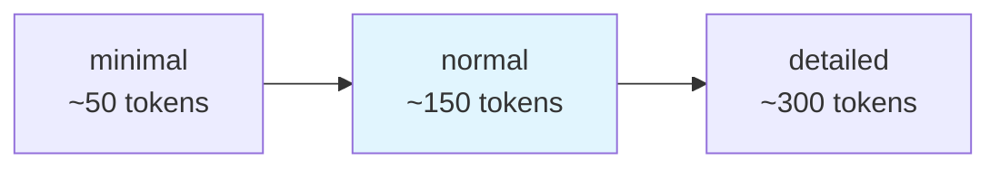

# Temporal Context

The temporal context system provides real-time F1 calendar awareness. Queries like "analyze the last race" work without specifying which race - the agent knows where we are in the season.

## Architecture



## Context Levels

The system provides temporal awareness at three levels:

### 1. Season Level

Tracks the overall championship phase:

- **Pre-Season** (Jan-Feb): Before first race
- **In-Season** (Mar-Nov): During championship
- **Post-Season** (Nov-Dec): After final race
- **Off-Season** (Dec-Feb): Winter break

### 2. Race Weekend Level

Tracks the current, last, and next race weekends:

- **Current Weekend**: Active race weekend (if within event window)
- **Last Completed**: Most recently finished race
- **Next Race**: Upcoming race with countdown

### 3. Session Level

Tracks individual sessions with real-time status:

- **Live Sessions**: Currently happening (with live indicator)
- **Recent Sessions**: Completed within last 24 hours
- **Upcoming Sessions**: Future sessions with countdown

## Data Structure

The `TemporalContext` captures season phase, current/last/next race weekends, and session-level status (live, recent, upcoming).

## Caching

The cache TTL adapts based on proximity to the next event: 5 minutes during race weekends, up to 24 hours during off-weeks.

## System Prompt Injection

The temporal context is formatted and injected into the agent's system prompt:

```python
temporal_ctx = get_temporal_context()
temporal_prompt = format_for_system_prompt(temporal_ctx, verbosity="normal")

system_prompt = {
    "type": "preset",
    "preset": "claude_code",
    "append": temporal_prompt,
}
```

### Progressive Disclosure

The formatter supports three verbosity levels - demonstrating how to manage context window usage:



| Level | Description |
|-------|-------------|
| `minimal` | Season phase and next race only |
| `normal` | Full context with current/last/next races (default) |
| `detailed` | All session details for debugging |

### Example Formatted Prompt

```markdown
# F1 Temporal Context (2024-05-23 14:30 UTC)

**Season Status**: 2024 Season - In Progress
- Races completed: 7/24
- Races remaining: 17

**Current Race Weekend**: Monaco Grand Prix (Round 8)
- Location: Monaco, Monaco
- Event Date: 2024-05-26
- Phase: Practice
- Current Session: FP1 (Live - Started 15 minutes ago)
- Next Session: FP2 (in 2 hours 15 minutes)

**Last Completed Race**: Emilia Romagna Grand Prix (Round 7)
- Location: Imola, Italy
- Completed: 3 days ago

**Next Race**: Monaco Grand Prix (in 3 days)
```

This context enables the agent to:
- Understand temporal references ("last race", "this weekend")
- Provide relevant suggestions ("FP1 just started - want to analyze lap times?")
- Avoid confusion about historical vs. current data

## Usage

### Get Current Context

```python
from pitlane_agent.temporal import get_temporal_context

context = get_temporal_context()

print(f"Season: {context.current_season}")
print(f"Phase: {context.season_phase}")
print(f"Next race: {context.next_race.event_name}")
```

### Force Cache Refresh

```python
from pitlane_agent.temporal import TemporalContextManager

manager = TemporalContextManager()
context = manager.get_context(force_refresh=True)
```

### Format for Prompt

```python
from pitlane_agent.temporal import format_for_system_prompt

# Normal verbosity (default)
prompt = format_for_system_prompt(context)

# Minimal (token-efficient)
prompt = format_for_system_prompt(context, verbosity="minimal")

# Detailed (debugging)
prompt = format_for_system_prompt(context, verbosity="detailed")
```

## Related Documentation

- [Agent System](agent-system.md) - How temporal context integrates with F1Agent
- [API Reference: Temporal](../api-reference/pitlane-agent/temporal.md) - Full API documentation
